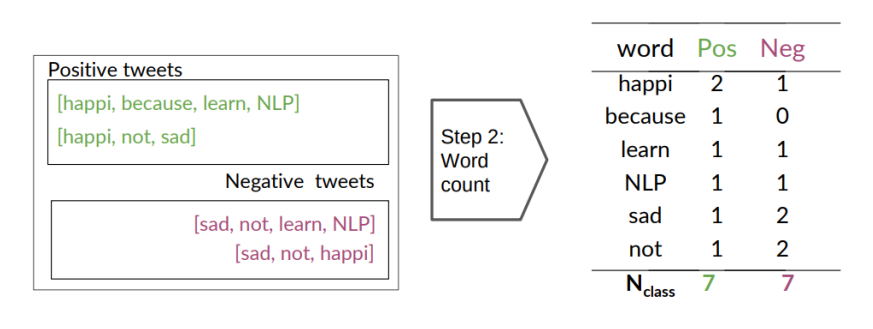
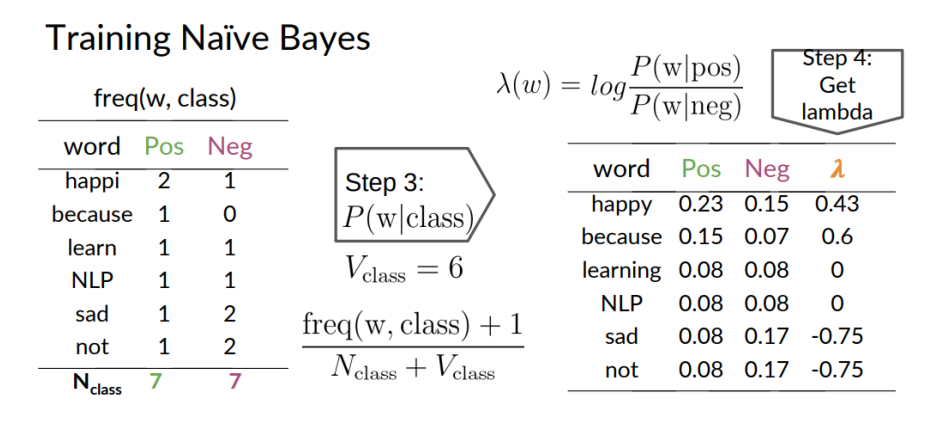
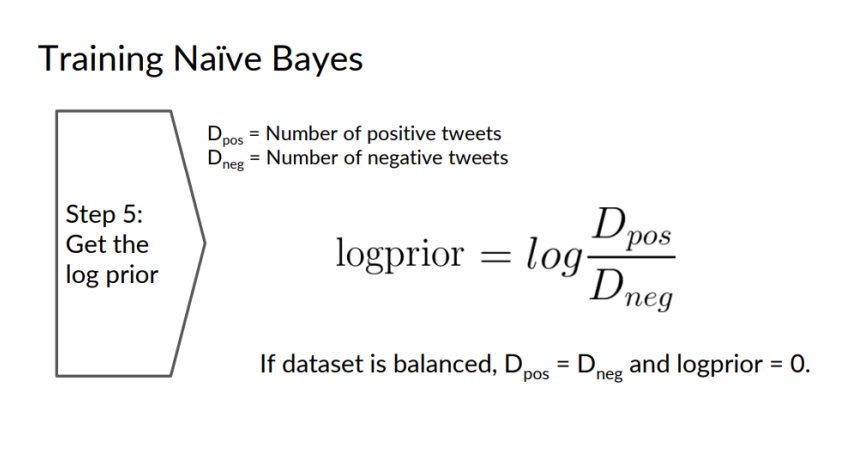
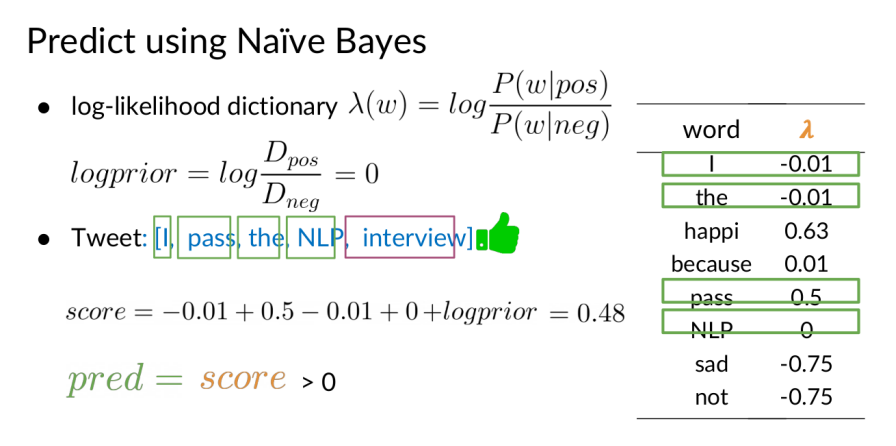

# مقدمه:
فرض کنید اپلیکیشن توییتر را باز کرده و در حال اسکرول کردن در تایم لاین خود هستید. پس از
خواندن هر توییت احتمالا حس خاصی خواهید داشت. به طور مثال ممکن است از خواندن داستان
موفقیت یک فرد حس مثبتی بگیرید یا از مطلع شدن در مورد تجربه تلخ فردی دیگر حس منفی بگیرید.
یا حتی حس خاصی نگیرید!

اما داستان به اینجا ختم نمی شود. احتمالا تجربه ثبت نظر در مورد یک محصول که از فروشگاه
آنلاین خریداری کردەاید را داشتەاید. یکی از مهم ترین دغدغەهای هر کسب وکاری این است که بتواند
نظرات مشتریان را درک کرده و به درستی از آن ها در جهت بهبود خدمت رسانی استفاده کند. پس
تشخیص حس وحال نظر شما برای آن فروشگاه آنلاین مقولەای حیاتی ست.

احتمالا با این توضیحات، تا این لحظه عبارات مثبت و منفی زیادی در ذهن شما نقش بسته
است. مغز انسان در دوران کودکی یاد می گیرد تا ادراک خود از محرک ها را دستەبندی کند. این کار
وابسته به عوامل پیچیدەی شناختی و علوم اعصاب است که در انسان تکامل یافته. حال فرض کنید
ما می خواهیم این روند را با استفاده از یک سیستم کامپیوتری به صورت خودکار انجام دهیم تا بتوانیم
به فروشگاه آنلاین کمک کنیم مشتریان خود و بازخوردشان به محصولاتش را بهتر بشناسد.

بدین منظور می توانیم از مدل های هوش مصنوعی بهره ببریم و قابلیت های شناختی انسان را
شبیەسازی کنیم. روش های متفاوتی برای این کار وجود دارد که رویکرد ما در اینجا استفاده از یک
مدل آماری برای طبقەبندی دادەها است. در ادامه بخش های مختلف این پروژه را شرح می دهیم.

# مدل طبقه بندی:
می دانیم که دو دسته کلی از مدل ها وجود دارند. اگر در حین آموزش̞ مدل از دادەهای برچسب گذاری شده
استفاده کنیم، با یادگیری تحت نظارت سروکار داریم. در این مسئله ما تعداد زیادی توییت جمع آوری
کردەایم و به آن ها برچسب مثبت، منفی یا خنثی نسبت دادەایم.

از شما می خواهیم با طراحی و آموزش یک مدل Bayes Naive که بر اساس قانون بیز در مورد
احتمالات شرطی کار می کند، سعی کنید توییت های تست را برچسب گذاری کنید. در حوزه دستەبندی
دادەهای متنی با مدل های آماری، باید از پارامتری به نام میزان تکرار کلمات استفاده کنیم. به طور
ساده به این معنی است که اگر کلمه خوش حال در توییت های مثبت بیش تر از توییت های منفی به کار
رفته پس این کلمه یک کلمه مثبت قلمداد می شود و اگر در یک توییت جدیدِ بدون برچسب این کلمه
را ببینیم وزن مثبت بودن آن توییت بالا می رود. در ادامه مراحل آموزش یک مدل برای طبقەبندی دو
دستەای را شرح می دهیم.

- از جایی که هر توییت ممکن است شامل توکن های اضافی باشد که دقت مدل ما را پایین بیاورد
پس باید در قدم اول دادەهای خود را تمیز کنیم. به طور مثال توییت زیر را با یک سری از
قواعد مرسوم تمیز کردەایم. شما هم سعی کنید با جست وجو در اینترنت تعدادی روش بهینه
برای این کار پیدا کرده و روی دادەهای خود اعمال کنید.

I am happy beacuse I am learning #NLP -> ['happy', 'beacuse', 'learn', 'nlp']

- جدولی از تعداد دفعات تکرار هر کلمه در توییت های مثبت و منفی تشکیل دهید. با این کار
می خواهیم به کلمات وزن دهی کنیم تا میزان مثبت یا منفی بودن آن ها مشخص شود.

- حال باید با استفاده از مقادیر ذخیرەشده در جدول مرحله قبل، احتمال وقوع هر کلمه در هر
کلاس را محاسبه کنیم. فرمول آن در عکس زیر مشخص شده است. در این فرمول مقادیری
به صورت و مخرج اضافه شده تا از احتمال صفر برای کلماتی که در یک کلاس مشاهده
نشدەاند پیشگیری شود. به این روش Smoothing Laplacian می گویند.

- متغیر لامبدا را بەعنوان پارامتر تصمیم گیری محاسبه می کنیم. در عکس بالا می بینیم که اگر این مقدار مثبت شود یعنی کلمه موردنظر مثبت است و اگر منفی شود یعنی کلمه منفی است.

-  یک عامل مهم که باید در محاسبات خود در نظر بگیریم تعداد توییت های مثبت و منفی است.
ممکن است تعداد توییت های این دو کلاس با هم برابر نباشد که در این صورت یک پارامتر
پیشینی مطابق تصویر زیر به محاسبات خود اضافه می کنیم.

# تست مدل:
تا به اینجا با مراحل آموزش یک مدل طبقەبندی آشنا شدید. مراحل بعدی بەمنظور تست کردن
این مدل و استفاده از آن برای برچسب گذاری توییت های جدید مورداستفاده قرار می گیرد.

- ابتدا هر توییت را مشابه مرحله قبل توکنایز کرده و تمیز می کنیم.

- حال برای هر توییت مجموع لامبداهای کلمات آن و پارامتر لگاریتمی پیشینی را محاسبه
می کنیم.

- در مرحله تصمیم گیری، باید امتیاز محاسبه شده را برای کلاس های مختلف بازەبندی کنیم. به
این صورت که اگر امتیاز مثبت شد یعنی توییت مثبت بوده و اگر منفی شد یعنی توییت منفی
بوده.

در مرحله آموزش از دادەهای train و در مرحله تست از دادەهای test استفاده می کنیم. در مرحله
تست باید خروجی مدلی که طراحی کردەایم را با لیبل های دادەشده مقایسه کنیم تا دقت مدل به
دست آید. به بیان دیگر در این مرحله ما برچسب ها را به مدل نمی دهیم. صرفا از مدل برای پیش بینی
برچسب ها استفاده کرده و آن را با برچسب درست مقایسه می کنیم.

تا اینجا با یک مدل طبقەبندی دوکلاسه آشنا شدیم. حال می خواهیم مدل مشابهی را برای
طبقەبندی سەکلاسه به صورت مثبت، منفی و خنثی پیادەسازی کنیم.

# روند کلی:
در حالت سه كلاسه هر كلمه در هر 
توئيت با توجه به برچسب توئيت شمرده می شود یعنی براي مثال داریم
كه كلمه not ده بار در كلاس 
مثبت، 100
بار دركلاس منفی و 5 بار در کلاس خنثی تكرار شده است.

 حال با استفاده از 
 bayes naïve طبق
فرمول، احتمال پيشین ضرب در احتمال رخ دادن کلمه به شرط احتمال پیشین به ازای همه کلمات موجود در توئیت می توانیم احتمال اینکه این توئیت از جنس احتمال پیشین باشد را نشان داد.

در واقع به طور مثال احتمال 
منفی بودن
 توئيت با توجه به تعداد تكرار كلمات آن در كلاس منفی ها و تعداد
 تكرار آن ها در كل را 
محاسبه كرده 
و براي دو كلاس ديگر نیز احتمال را محاسبه ميكنيم. حال هر احتمالی که بیشتر باشد را به عنوان پیش بینی برمیگردانیم.

# بررسی فایل های موجود در پروژه:

## train_data.csv:
داده های مربوط به train مدل که شامل لیبل هستند.

## eval_data.csv:
داده های مربوط به evaluation و ارزیابی مدل train شده که شامل لیبل هستند.

## test_data_nolabel:
داده های مربوط به test که برای ارزیابی نهایی مورد استفاده قرار گرفت و فاقد لیبل گذاری هستند.

## template.py:
این فایل شامل کلاسی است که تابع های مربوط به پیاده سازی مدل در آن قرار دارند. 

این کلاس شامل توابع زیر می باشد:

- train(self, data):

به ازاي هر توئيت 
تعداد توئيت ها و به ازاي كلمات آنها تعداد كلمات متناسب با label هر توئيت را update ميكند و 
اين كار را به ازاي تمام توئيت ها انجام ميدهد.

- calculate_prior(self, label):

به ازاي هر لیبل صرفا بر 
 اساس تعداد توئيت هاي آن لیبل احتمال رخداد آن 
لیبل را بررسی ميكند.

- calculate_likelihood(self, word, label):

بر اساس تعداد كلمات در هر لیبل احتمال رخداد آن کلمه به شرط اينكه
توئيت مورد نظر از لیبل خاصی باشد را محاسبه ميكند.

- classify(self, features):

در مواجهه با هر توئيت به ازاي تمام لیبل ها احتمال اينكه اين توئيت متعلق به آن لیبل ها باشد را محاسبه کرده و احتمال ماکزیموم را به عنوان خروجی برمیگرداند. 

## run.py:
این فایل مربوط به استخراج داده ها و آموزش و ارزیابی آن ها و در نهایت تست شان می باشد که دارای توابع زیر است:

- preprocess(tweet_string):

یک رشته (متن توئیت) را دریافت کرده و آن را تمیز می کند و کاراکترهای اضافی را از آن حذف می کند. سپس کلماتی را که معانی مثبت یا منفی ندارند (مانند حروف ربط) را حذف کرده و خروجی را به صورت لیستی از کلمات برمیگرداند.

- load_data(data_path):

داده های مربوط به train و evaluation را از فایل csv مربوطه خوانده و در نهایت به صورت لیستی از tuple های دوتایی (کلمات توئیت و لیبل) برمیگرداند.

- load_test_data(data_path):

این تابع کار فوق را برای داده های test انجام میدهد.

- main():

در این تابع train مدل مان انجام میشود و زمان آن ثبت میشود و در بخش بعد validatoin روی داده های evaluation انجام شده و دقت مدل چاپ میشود و در بخش آخر نیز label گذاری بر روی داده های test صورت میگیرد.

## label.txt:
نتیجه ی فرآیند لیبل گذاری با استفاده از مدل مربوطه روی داده های تست در این فایل ذخیره شده است.

# نتیجه:
این مدل بر روی داده های evaluation به دقت 64.71 رسید.
و همچنین لازم به ذکر است که در نهایت این مدل با 66 درصد دقت روی داده های تست به عنوان دقیق ترین مدل در بین سایر پروژه ها به ثبت رسید.

# ذی نفعان پروژه:
[سید محمدعلی میرمحمدی](https://github.com/Smamm1382)

**طراحان پروژه:** بکتاش انصاری - سینا زمانی
